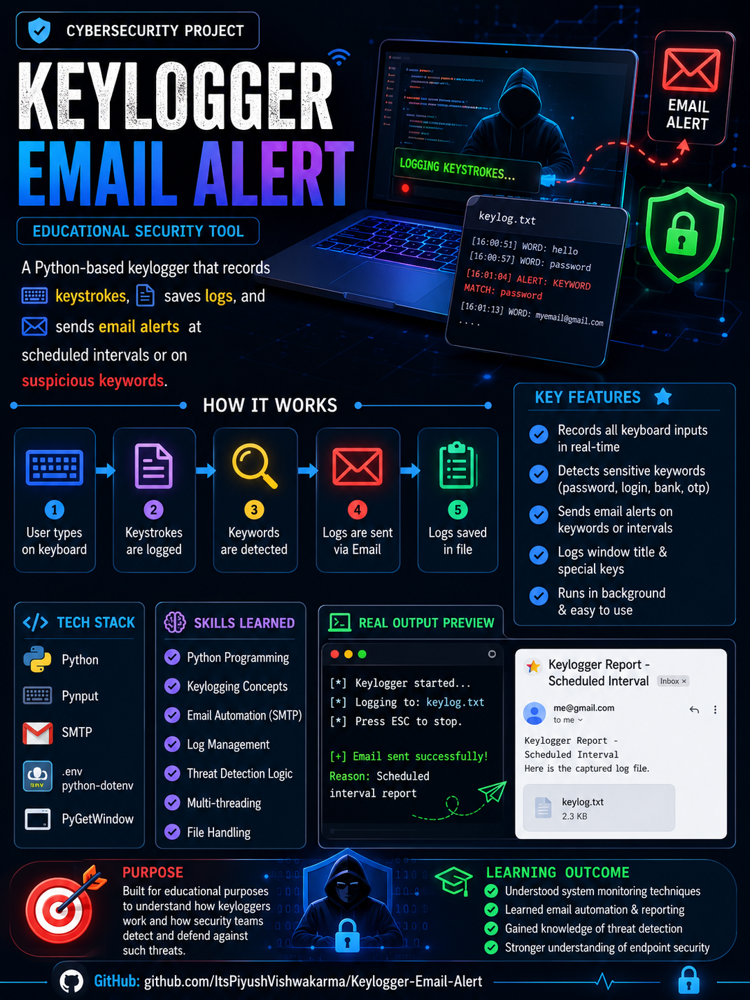
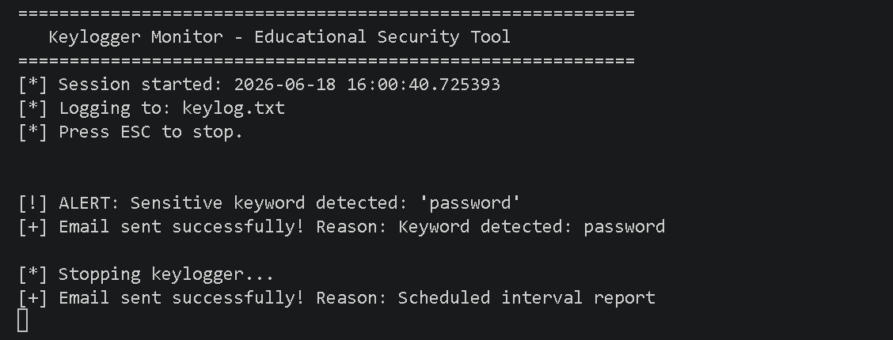
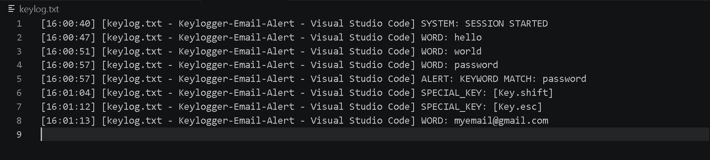
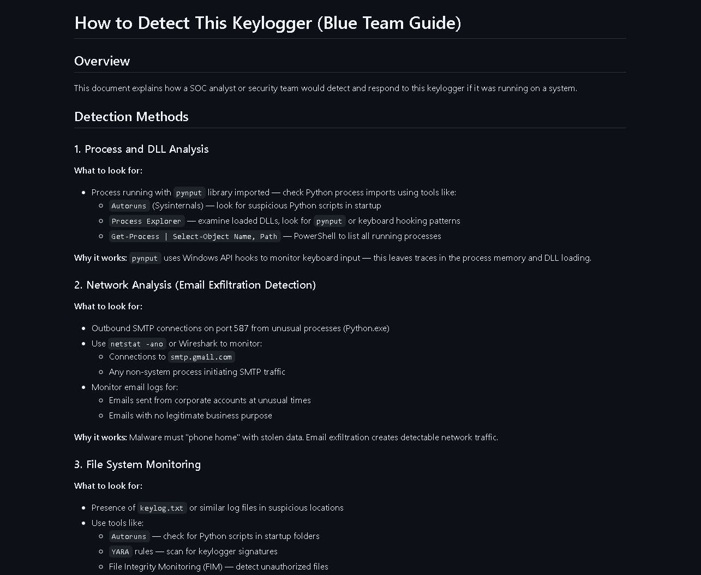

# Keylogger Email Alert

A Python-based educational cybersecurity project that demonstrates keyboard activity monitoring, keyword detection, automated email reporting, and endpoint detection concepts.

This project was created to understand how keylogging techniques work, how attackers may collect information, and how security teams detect and investigate such behavior.

---

## Educational Use Only

This project is intended for cybersecurity learning, security awareness, and defensive research purposes only.

Do not deploy or use this software on systems you do not own or have explicit authorization to test.

---

# Project Overview

The application monitors keyboard activity, records keystrokes into a log file, tracks the active application window, detects sensitive keywords, and automatically sends email alerts when specific conditions are met.

### Example Use Cases

- Security awareness training
- Understanding endpoint monitoring
- Learning event-driven programming
- Studying malware behavior
- Blue Team detection practice
- SOC Analyst skill development

---

# Features

- Real-time keyboard monitoring
- Active window tracking
- Sensitive keyword detection
- Automated email notifications
- Scheduled reporting intervals
- Log file generation
- Environment variable protection
- Modular project structure
- Blue Team detection guide included

---

# How It Works

```text
User Types
      ↓
Keystrokes Captured
      ↓
Words Logged
      ↓
Keyword Detection
      ↓
Email Alert Triggered
      ↓
Report Saved
```

---

# Project Workflow

1. User types on keyboard
2. Keystrokes are captured
3. Current active window is recorded
4. Words are stored in log file
5. Sensitive keywords are checked
6. Email alert is generated
7. Scheduled reports are sent automatically

---

# Technologies Used

| Technology | Purpose |
|------------|----------|
| Python | Core programming language |
| pynput | Keyboard monitoring |
| smtplib | Email delivery |
| python-dotenv | Secure credential storage |
| pygetwindow | Active window tracking |
| threading | Scheduled reports |
| VS Code | Development environment |
| Git & GitHub | Version control |

---

# Project Structure

```text
Keylogger-Email-Alert
│
├── screenshots/
│   ├── keylogger_email_alert_overview.png
│   ├── keylog_alert_demo.png
│   ├── keylog_file_format.png
│   └── detection_guide_preview.png
│
├── config.py
├── gw_helper.py
├── email_sender.py
├── keylogger.py
├── detection_guide.md
├── requirements.txt
├── README.md
├── .gitignore
└── .env
```

---

# Installation

Clone the repository:

```bash
git clone https://github.com/ItsPiyushVishwakarma/Keylogger-Email-Alert.git
```

Move into the project folder:

```bash
cd Keylogger-Email-Alert
```

Install dependencies:

```bash
pip install -r requirements.txt
```

---

# Requirements

```text
pynput
python-dotenv
pygetwindow
```

---

# Configuration

Create a `.env` file:

```env
EMAIL_ADDRESS=your_email@gmail.com
EMAIL_PASSWORD=your_app_password
RECEIVER_EMAIL=receiver@gmail.com
```

Update settings inside `config.py`:

```python
EMAIL_INTERVAL_SECONDS = 60
MIN_KEYS_BEFORE_ALERT = 20

ALERT_KEYWORDS = [
    "password",
    "login",
    "bank",
    "otp"
]
```

---

# Running The Project

```bash
python keylogger.py
```

Stop monitoring:

```text
Press ESC
```

---

# Example Log Output

```text
[16:00:47] WORD: hello
[16:00:51] WORD: world
[16:00:57] WORD: password
[16:00:57] ALERT: KEYWORD MATCH: password
[16:01:04] SPECIAL_KEY: [Key.shift]
```

---

# Email Alert Example

```text
Subject:
Keylogger Report - Keyword detected

Reason:
Sensitive keyword detected

Attachment:
keylog.txt
```

---

# Blue Team Detection Guide

This project includes a dedicated detection guide:

```text
detection_guide.md
```

Topics covered:

- Process Analysis
- DLL Analysis
- SMTP Monitoring
- Event Log Investigation
- File Monitoring
- IOC Identification
- EDR Detection Logic
- SIEM Detection Concepts

Useful for:

- SOC Analysts
- Security Analysts
- Blue Team Engineers
- Incident Responders

---

# Skills Demonstrated

### Cybersecurity

- Endpoint Monitoring
- Threat Detection
- Security Awareness
- Log Analysis
- Detection Engineering
- Blue Team Concepts

### Python

- Event Handling
- File Management
- Email Automation
- Multi-threading
- Environment Variables
- Modular Programming

### Security Operations

- IOC Identification
- Behavioral Analysis
- Alerting Mechanisms
- Incident Investigation Concepts

---

# Screenshots

## Project Overview



---

## Alert Detection Demo



---

## Log File Format



---

## Detection Guide



---

# Learning Outcomes

Through this project I gained practical experience with:

- Python automation
- Keyboard event monitoring
- Email automation using SMTP
- Log generation and management
- Active window tracking
- Detection engineering concepts
- Security monitoring techniques
- SOC Analyst workflows

---

# Author

**Piyush Vishwakarma**

MCA (Cybersecurity) Student  
AWS Certified Cloud Practitioner  
Aspiring SOC Analyst

GitHub:
https://github.com/ItsPiyushVishwakarma

LinkedIn:
https://linkedin.com/in/itspiyushkarma-cybersecurity

---

# License

This project is provided for educational and research purposes only.